# PulseCity
<div align="center">

# 🏙️ PulseCity

> Dağıtık ve gerçek zamanlı veri işleme platformu.

<br />


<br />

</div>

---
Go, Kafka ve ScyllaDB ile şehir içi trafik yoğunluğunu **saniyede 50.000 GPS
ping'i** hızında, sıfır kayıpla işleyen gerçek zamanlı veri boru hattı —
Uber/Yandex'in çözdüğü probleme benzer bir mimari. Canlı Leaflet haritası,
bölgesel anomali tespiti, alarm zinciri ve TLS'li blue-green production
kurulumu dahil.

Ölçülen (Faz 3): **50.477 msg/sn** işlenen · **0** kayıp · **0** DLQ ·
ScyllaDB yazma p99 **48,4 ms**

## Mimari

```mermaid
flowchart TB

    subgraph P1["Yol 1 · VERİ — garanti: hiçbir mesaj sessizce kaybolmaz"]
        direction LR
        PR["<b>producer</b><br/>Go · 2000 sanal araç<br/>acks = All"]
        KF["<b>Kafka</b><br/>12 partition · KRaft<br/>key = zone_id"]
        CO["<b>consumer</b><br/>zone bazlı UnloggedBatch<br/>EMA anomali · manuel commit"]
        SC["<b>ScyllaDB</b><br/>PK zone_id, ping_time, vehicle_id<br/>TTL 1 saat · TWCS"]
        DLQ["<b>DLQ</b><br/>vehicle-pings-dlq<br/>7 gün retention"]
        PR --> KF --> CO --> SC
        CO -. "parse / yazma hatası" .-> DLQ
    end

    subgraph P2["Yol 2 · SUNUM — garanti: best-effort; düşmesi veri yolunu etkilemez"]
        direction LR
        KF2["Kafka<br/>group: pulsecity-webviz<br/><i>ana consumer'dan bağımsız</i>"]
        WV["<b>webviz</b><br/>Go · :8080<br/>bellekte son konum tablosu"]
        MAP["<b>Canlı harita</b><br/>WebSocket + Leaflet<br/>1 snapshot / sn"]
        HIST["<b>Geçmiş API</b><br/>/api/history<br/>ScyllaDB'den son 30 dk"]
        KF2 --> WV --> MAP
        WV --> HIST
    end

    subgraph P3["Yol 3 · GÖZLEMLENEBİLİRLİK — garanti: yalnızca okur, kritik yola dokunmaz"]
        direction LR
        PM["<b>Prometheus</b><br/>metrik toplama<br/>alerts.yml"]
        AM["<b>Alertmanager</b><br/>gruplama · susturma<br/>Slack (prod)"]
        LK["<b>Loki</b><br/>Promtail ile<br/>JSON log toplama"]
        GR["<b>Grafana</b><br/>dashboard + log paneli"]
        PM --> AM
        PM --> GR
        LK --> GR
    end

    subgraph P4["Production kenarı (Faz 16, 18)"]
        direction LR
        CD["<b>Caddy</b> · otomatik TLS + HTTP/3 · lb_policy first<br/>/ → webviz · /grafana/ → Grafana"]
        BL["<b>webviz (blue)</b><br/>canlı kopya"]
        GN["<b>webviz-green</b><br/>yalnız deploy sırasında"]
        CD --> BL
        CD --> GN
    end

    classDef veri fill:#e8f5e9,stroke:#2e7d32,color:#1b5e20
    classDef dlq fill:#ffebee,stroke:#c62828,color:#b71c1c
    classDef sunum fill:#e3f2fd,stroke:#1565c0,color:#0d47a1
    classDef soluk fill:#f4f6f8,stroke:#90a4ae,color:#546e7a
    classDef gozlem fill:#ede7f6,stroke:#5e35b1,color:#311b92
    classDef prod fill:#f5f2e8,stroke:#8d7b4f,color:#4e3f1f

    class PR,KF,CO,SC veri
    class DLQ dlq
    class WV,MAP,HIST sunum
    class KF2 soluk
    class PM,AM,LK,GR gozlem
    class CD,BL,GN prod
```



Sistem **üç ayrı yoldan** oluşur ve her yol farklı bir garanti taşır. Bu ayrım
mimarinin en önemli kararı: sunum ve gözlemlenebilirlik katmanlarının hiçbiri
zero-loss veri yolunun üzerine oturmaz, dolayısıyla biri düşünce diğeri durmaz.

| Yol | Bileşenler | Garanti |
|---|---|---|
| **Veri yolu** | producer → Kafka → consumer → ScyllaDB | Zero-loss: hiçbir mesaj sessizce kaybolmaz (Faz 2) |
| **Sunum yolu** | Kafka → webviz → WebSocket/Leaflet, geçmiş için ScyllaDB | Best-effort: ayrı consumer group, throttle'lı; düşmesi veri yolunu etkilemez (Faz 9, 11) |
| **Gözlemlenebilirlik yolu** | Prometheus/Alertmanager (metrik) + Promtail/Loki (log) → Grafana | Yan etkisiz: yalnızca okur, kritik yola hiç dokunmaz (Faz 4, 13, 17) |

### Veri ve sunum yolu

```
   ┌──────────────────┐                    ┌───────────────────────────────────────────┐
   │     producer     │   acks = All       │         Kafka  (KRaft, tek broker)        │
   │    Go · :2112    │   retry + backoff  │  vehicle-pings      12 partition · 1 saat │
   │  2000 sanal araç │ ──────────────────>│  vehicle-pings-dlq   3 partition · 7 gün  │
   │   key = zone_id  │                    └──┬─────────────────────────────────────┬──┘
   └──────────────────┘                       │                                     │
                         group: pulsecity-consumers              group: pulsecity-webviz
                                              v                                     v
          ┌────────────────────────────────────────────┐   ┌───────────────────────────────┐
          │                  consumer                  │   │            webviz             │
          │        Go · :2113 · yatay ölçeklenir       │   │          Go · :8080           │
          │  zone bazlı UnloggedBatch (2000 satır)     │   │  bellekte "son konum" tablosu │
          │  ÖNCE ScyllaDB'ye yaz, SONRA offset commit │   │  1 sn'de bir WS snapshot      │
          │  EMA baseline + bölge anomali tespiti      │   │  Leaflet arayüz (go:embed)    │
          │  parse/yazma hatası ──> DLQ topic'ine      │   │  geçmiş: /api/history         │
          └─────────────────────┬──────────────────────┘   └───────────────┬───────────────┘
                                │                                          │
                                v                                          │ son 30 dk · 9 bölge
                     ┌──────────────────────────────────────┐              │
                     │               ScyllaDB               │<─────────────┘
                     │  PK (zone_id, ping_time, vehicle_id) │
                     │  TTL 1 saat · TWCS 10 dakika pencere │
                     └──────────────────────────────────────┘
```

### Gözlemlenebilirlik yolu

```
   producer  :2112 ─┐
   consumer  :2113 ─┤                                  ┌──> Alertmanager :9093 ──> Slack*
   webviz    :8080 ─┼──> Prometheus :9090 ─ alerts.yml ┘     (gruplama · susturma)
   kafka-exporter  ─┘         │      ^
   :9308 (lag)                │      └── webviz anomali rozetini buradan okur (PROM_URL)
                              v
                         Grafana :3000 <── Loki :3100 <── Promtail <── docker.sock (JSON log)
```

\* Slack bildirimi yalnızca **prod** profilinde bağlıdır
(`monitoring/alertmanager.prod.yml`, webhook `slack_api_url_file` ile SOPS'tan
çözülen dosyadan okunur). Local `alertmanager.yml`'de bildirim kanalı bilerek
boştur — alarmların üretildiği ve doğru gruplandığı http://localhost:9093
arayüzünden doğrulanır.

Alarm kuralları (`monitoring/alerts.yml`) iki sınıfa ayrılır. **critical**:
batch commit edilemiyor, ScyllaDB bağlantısı yok, servis kapalı, producer yazma
hatası, boru hattı durdu. **warning**: DLQ doluyor, consumer lag > 200k,
ScyllaDB yazma gecikmesi yüksek. Faz 18'in otomatik rollback'i tam olarak bu
`critical` sınıfını okur — "kötü gidiyor"un makine tarafından okunabilir tanımı budur.

### Production kenarı (Faz 16, 18)

Local'de her servis kendi portunu dışa açar. Production override'ında
(`deploy/docker-compose.prod.yml`) tek dış kapı Caddy'dir; Prometheus,
Alertmanager, Loki ve producer metrik portları `ports: []` ile kapatılır,
arayüzlerine SSH tüneliyle bakılır.

```
   internet ──80/443──> Caddy (otomatik TLS · Let's Encrypt · HTTP/3)
                          ├── /         ──> webviz (blue) ─┐ lb_policy first
                          │                 webviz-green  ─┘ = sıradaki İLK SAĞLIKLI upstream
                          └── /grafana/ ──> Grafana
```

Blue-green geçişi bir **konteyner işlemi**: yeşili ayağa kaldır, `/readyz` ile
hazır olduğunu doğrula, maviyi durdur. Caddy yapılandırması hiç değişmez, reload
yoktur. `webviz-green` normalde `bluegreen` compose profili arkasında durur ve
yalnızca `./scripts/deploy-webviz.sh` çalışırken ayağa kalkar.

### Servis envanteri

| Servis | Rol | Local port | Prod'da dışa açık |
|---|---|---|---|
| `producer` | Go load generator; sanal araç GPS ping'i üretir | 2112 (metrik) | hayır |
| `consumer` | Kafka → ScyllaDB, DLQ, EMA anomali tespiti | 2113 (metrik) | hayır (prod'da 2 replika) |
| `webviz` | WebSocket yayını + Leaflet harita + geçmiş API'si | 8080 | Caddy üzerinden `/` |
| `webviz-green` | Blue-green'in yeşil kopyası (`bluegreen` profili) | — | yalnızca geçiş anında `/` |
| `kafka` | Tek broker, KRaft (Zookeeper yok) | 9092 | hayır |
| `scylla` | Zaman serisi deposu | 9042 | hayır |
| `kafka-exporter` | Consumer lag metriği (uygulama kodundan expose edilemez) | 9308 (iç ağ) | hayır |
| `prometheus` | Metrik toplama + alarm hesaplama | 9090 | hayır (SSH tüneli) |
| `alertmanager` | Gruplama, susturma, bildirim (Slack yalnız prod) | 9093 | hayır (SSH tüneli) |
| `loki` / `promtail` | Log deposu / Docker API'den log keşfi | 3100 | hayır (Grafana üzerinden) |
| `grafana` | Dashboard + log paneli | 3000 | Caddy üzerinden `/grafana/` |
| `caddy` | Reverse proxy, otomatik TLS, blue-green yönlendirme | — (yalnız prod) | 80 / 443 |

Üç Go servisinin üçü de aynı sözleşmeyi taşır: `/metrics` (Prometheus),
`/healthz` (process ayakta mı) ve `/readyz` (bağımlılığı gerçekten çalışıyor mu).
Ayrım kasıtlı — `/readyz` producer'da Kafka'ya son başarılı yazmanın üstünden
geçen süreye, consumer'da canlı bir ScyllaDB sorgusuna bakar; salt process
kontrolü "ayakta ama hiçbir şey yazamıyor" durumunu göremezdi.

### Kafka konuları ve consumer group'ları

| Konu | Partition | Retention | Not |
|---|---|---|---|
| `vehicle-pings` | 12 | 1 saat / partition başına 512 MiB | `segment.bytes` 128 MiB'a çekildi; Kafka yalnızca KAPANMIŞ segmenti silebilir, 1 GiB'lik varsayılanla 512 MiB'lik tavan hiç devreye giremezdi |
| `vehicle-pings-dlq` | 3 | 7 gün | Uzun olması bilerek: oradaki mesajlar incelenmek için var, hacmi de düşük |

| Consumer group | Kim | Neden ayrı |
|---|---|---|
| `pulsecity-consumers` | consumer replikaları | Zero-loss kritik yolu; manuel offset commit |
| `pulsecity-webviz` | canlı harita | Ana consumer'ın offset'ine dokunmaz, ondan mesaj çalmaz |
| `pulsecity-webviz-green` | blue-green yeşil kopya | Aynı group'u paylaşsalardı Kafka partition'ları ikiye böler, iki harita da akışın yalnızca yarısını görürdü |

### Veri modeli

```sql
PRIMARY KEY (zone_id, ping_time, vehicle_id)   -- CLUSTERING ORDER BY (ping_time DESC)
default_time_to_live = 3600                    -- haritanın geriye bakma penceresinin 2 katı
gc_grace_seconds     = 3600                    -- RF=1'de repair penceresine gerek yok
compaction           = TimeWindowCompactionStrategy (10 dakika)
```

TTL ile TWCS birlikte seçildi: TWCS her zaman penceresini ayrı bir SSTable'da
tutar, böylece süresi tamamen dolmuş bir pencere pahalı bir compaction
beklemeden, dosya silinerek geri kazanılır. Varsayılan SizeTiered'da süresi
dolmuş satırlar taze verinin içine karışırdı.

**Neden bu tasarım kararları:**

| Karar | Gerekçe |
|---|---|
| Kafka partition key = `zone_id` | Aynı bölgenin ping'leri aynı partition'a gider → bölge içi sıralama korunur |
| ScyllaDB partition key = `zone_id` | Bölge bazlı sorguları hızlandırır, tek bir global sayaç yerine 9 bölgeye dağıtarak hot-partition riskini azaltır |
| Bölge = tek bir gerçek ilçe (1:1) | Başlangıçta 3 ilçe × 3 alt bölge vardı (`kadikoy-1/2/3` gibi); haritada aynı ilçe adını taşıyan üç çember yayılınca en dıştaki komşu ilçenin üzerindeymiş gibi görünüyor ve yanlış ilçe adı okunuyordu. İstanbul'un en kalabalık 9 ilçesine bire bir eşleme bu belirsizliği kaldırdı — `TestZoneCirclesDoNotOverlap` çakışmayı kilitler |
| Manuel Kafka offset commit | Auto-commit ile "işlemeden önce commit" riski var — zero-loss için önce ScyllaDB'ye yaz, sonra commit et |
| UnloggedBatch (zone bazlı), LoggedBatch değil | ScyllaDB'de çoklu-partition LoggedBatch pahalı bir batchlog mekanizması kullanır; aynı partition içi UnloggedBatch + paralel goroutine çok daha performanslı |
| DLQ (dead-letter queue) | Hiçbir mesaj sessizce kaybolmasın — parse/yazma hatası olan her mesaj DLQ'ya yönlendirilir |
| Anomali tespiti consumer'da, webviz'de değil | `zone_id` hem Kafka hem ScyllaDB partition key'i olduğu için bir bölgenin tüm mesajları tek bir consumer replikasına düşer; `--scale consumer=3` yapıldığında EMA baseline'ı bölünmez. webviz sonucu Prometheus'tan okur, yeniden hesaplamaz |
| Harita için ayrı servis + ayrı consumer group | Sunum katmanını zero-loss yoluna eklemek onu dayanıklılık garantisine bağlardı; ayrıca `--scale consumer=3` durumunda her replika akışın yalnızca bir kısmını görür, harita eksik olurdu |
| WebSocket'te saniyede bir snapshot | 5000+ msg/sn tarayıcıya iletilemez; bellekte "her aracın son konumu" tutulup saniyede bir yayınlanınca ağ yükü mesaj hızından bağımsız hale gelir (37 KB/snapshot, 1500 araç) |
| Consumer lag için ayrı exporter | Lag Kafka'nın kendi metriği, uygulama kodundan expose edilemez; exporter olmadan üzerine alarm kurulamıyordu |
| Nginx yerine Caddy | Sertifikayı kendisi alır, kendisi yeniler ve HTTP'yi HTTPS'e kendisi yönlendirir. Nginx'te aynı şey certbot + timer + reload kancası + TLS blokları demekti — dört ayrı, sessizce bozulabilen parça |
| Blue-green yalnızca webviz'e | Consumer zaten Kafka rebalance'ı ile yatay; Kafka/ScyllaDB gibi stateful bileşenler blue-green'e hiç girmez (iki kopya aynı veriyi paylaşamaz). Kesintisiz deploy'a gerçekten ihtiyacı olan tek katman kullanıcıya bakan taraf |

## Klasör yapısı

```
.
├── docker-compose.yml        # Local yığın: Kafka, ScyllaDB, producer, consumer, webviz,
│                             # kafka-exporter, Prometheus, Alertmanager, Loki, Promtail, Grafana
├── .env.example              # Prod ortam değişkenleri şablonu (Grafana, yük profili, alan adı)
├── producer/                 # Go load generator (sanal araç GPS ping üreteci)
├── consumer/                 # Go consumer (Kafka -> ScyllaDB, DLQ, EMA anomali tespiti)
├── webviz/                   # Go WebSocket servisi + Leaflet canlı harita (Faz 9)
│   ├── history.go            #   ScyllaDB'den geçmişe bakma (Faz 11)
│   ├── limits.go             #   Koruma katmanı: hız sınırı, WS tavanı, origin (Faz 12)
│   └── static/index.html     #   Harita arayüzü (binary'ye go:embed ile gömülü)
├── scylla-init/schema.cql    # ScyllaDB şeması + TTL/TWCS veri yaşam döngüsü
├── monitoring/               # prometheus.yml, alerts.yml, alertmanager(.prod).yml,
│                             # loki-config.yml, promtail-config.yml, grafana/provisioning
├── scripts/                  # verify-zero-loss · benchmark · chaos-test · deploy-webviz · secrets
├── deploy/                   # prod/CI/bench compose override'ları, Caddyfile (TLS + blue-green),
│                             # nginx.conf (Faz 16 öncesi kurulum), DEPLOY.md
├── infra/terraform/          # VPC, EC2, IAM/SSM, security group, VPC flow log, cloud-init (Faz 14)
├── secrets/                  # SOPS + age ile şifrelenmiş sırlar ve örnek dosyaları (Faz 15)
├── .sops.yaml                # Hangi dosyanın hangi age anahtarıyla şifreleneceği
└── .github/workflows/ci.yml  # lint · test · uçtan uca · sır hijyeni · Trivy/SBOM · IaC · imaj · deploy
```

## Hızlı başlangıç (local)

```bash
docker compose up -d --build
```

Servisler ayağa kalktıktan (~30sn) sonra:

- **Canlı harita**: http://localhost:8080 — bölgeler yoğunluğa göre renklenir,
  araçlar nokta olarak akar, anomali tespit edilen bölge kırmızı yanıp söner
- **Grafana**: http://localhost:3000 (admin / pulsecity) — canlı dashboard +
  log paneli (Faz 17)
- **Prometheus**: http://localhost:9090 — ham metrikler
- **Alertmanager**: http://localhost:9093 — alarm durumu, gruplama ve
  susturma (Faz 13)
- **Loki**: http://localhost:3100 — log sorgusu; Grafana'dan da erişilebilir
  (Faz 17)
- ScyllaDB'de veri doğrulama: `docker exec -it pulsecity-scylla cqlsh -e "SELECT * FROM pulsecity.vehicle_pings LIMIT 10;"`

Consumer'ı paralel ölçeklendirmek için:

```bash
docker compose up -d --scale consumer=3
```

## Faz faz yol haritası ve sonuçlar

### Faz 1 — MVP ✅
Uçtan uca happy-path: producer → Kafka → consumer → ScyllaDB. `docker-compose.yml`,
`producer/`, `consumer/`, `scylla-init/` bu fazda kuruldu.

### Faz 2 — Zero-Loss Garantisi ✅
- Producer: `RequireAll` acks + retry-with-backoff (`writeWithRetry`)
- Consumer: manuel offset commit, sadece ScyllaDB'ye yazdıktan/DLQ'ya yönlendirdikten SONRA commit
- Doğrulama: `./scripts/verify-zero-loss.sh` — consumer'ı işlem ortasında SIGKILL ile
  öldürür, sonra Kafka'daki **tekil birincil anahtar** sayısı ile (ScyllaDB satırı + DLQ
  mesajı) toplamının eşit olduğunu doğrular

  Neden ham mesaj sayısıyla değil: tablonun birincil anahtarı
  `(zone_id, ping_time, vehicle_id)` ve ScyllaDB'nin `timestamp` tipi milisaniye
  hassasiyetinde. Aynı aracın aynı milisaniyeye düşen iki ping'i ikinci bir satır değil,
  üzerine yazma üretir — ölçülen oran ~%7. Ham sayıyla karşılaştıran bir test, boru hattı
  hiçbir şey kaybetmese bile başarısız görünür.

  Ölçülen sonuç (30sn, 5000 msg/sn): 165.000 mesaj → 6.430'u aynı anahtara düştü →
  beklenen 158.570 tekil satır; ScyllaDB'de tam olarak 158.570 satır, DLQ boş, kayıp yok.

### Faz 3 — Performans (50k/sn hedefi) ✅
- Producer: 8 paralel worker goroutine, her biri kendi Kafka bağlantısı ve ayrık araç
  grubuyla çalışır (data race'siz)
- Consumer: mesajlar `zone_id`'ye göre gruplanır, her grup paralel `UnloggedBatch`
  ile yazılır; batch boyutu 2000'e çıkarıldı
- Ölçüm: `./scripts/benchmark.sh 300` — hedef hızda ayağa kaldırır, Prometheus'tan
  throughput/gecikme/lag metriklerini çekip `benchmark-results.md` üretir

**Ölçülen sonuç — hedef tutturuldu.** 180 saniyelik ölçüm (+60sn ısınma):

| Metrik | Değer |
|---|---|
| Üretilen throughput | **51.193 msg/sn** |
| İşlenen throughput | **50.477 msg/sn** |
| Hedefe ulaşma | **%101** |
| ScyllaDB batch yazma p50 / p95 / p99 | 18,4 / 38,7 / **48,4 ms** |
| Producer hata oranı | **0** |
| DLQ oranı | **0** |

Test ortamı: Docker'a ayrılmış 12 çekirdek / 7,6 GB · Kafka tek broker (KRaft, 12 partition) ·
ScyllaDB tek node RF=1 (4 shard / 2,5 GB) · 1 consumer replikası. Ölçüm sırasında anomali
demo modu kapalıdır (yapay tıkanıklık bölgesel hız metriklerini bozar).

**Consumer geride kalmıyor.** Lag'i 10 saniye aralıklarla örnekledim:
16.500 → 48.000 → 32.000 → 29.500 → **0** → 48.000 mesaj. Bu testere dişi deseni batch'leme
kaynaklı: consumer 2000'lik grupları biriktirip boşaltıyor. Kritik olan **lag'in düzenli
olarak 0'a inmesi** — sistem yetişemiyor olsaydı lag hiç sıfırlanmaz, monoton büyürdü.
Tepe değeri 48.000 mesaj, 50k/sn hızda yaklaşık 1 saniyelik uçuş halindeki veriye denk geliyor.

Günlük geliştirmede `docker-compose.yml` bilerek hafif bir profille (5.000 msg/sn) gelir ki
bir laptop'ı boğmasın. Hedef hız `deploy/docker-compose.bench.yml` override'ıyla açılır:

```bash
docker compose -f docker-compose.yml -f deploy/docker-compose.bench.yml up -d --build
./scripts/benchmark.sh 180
```

### Faz 4 — Monitoring (Prometheus + Grafana) ✅
- Her iki Go servisi de `/metrics` endpoint'i expose eder (producer: 2112, consumer: 2113)
- Grafana dashboard'u otomatik provision edilir (`monitoring/grafana/provisioning/`):
  throughput, hata/DLQ oranı, **bölge bazlı araç yoğunluğu**, **bölge bazlı ortalama hız**,
  ScyllaDB yazma gecikmesi (p50/p95/p99)

### Faz 5 — Dayanıklılık (Chaos Testing) ✅
- `./scripts/chaos-test.sh` — consumer, Kafka broker ve ScyllaDB için sırayla crash
  simülasyonu yapar, recovery süresini ve veri kaybı olup olmadığını ölçer
- Sonuçlar: bkz. `chaos-test-results.md` *(script çalıştırıldıktan sonra üretilir)*

### Faz 6 — Canlıya Alma (Deployment) ✅
- `deploy/docker-compose.prod.yml`: kaynak limitleri, restart policy, 3 consumer replikası
- `deploy/nginx.conf`: Grafana'yı tek bir public port (80) üzerinden dışa açar
- `deploy/DEPLOY.md`: adım adım VPS kurulum rehberi (Hetzner/DigitalOcean, 2vCPU/4GB yeterli)

### Faz 7 — Belgeleme ✅
Bu README — mimari, tasarım kararları, kurulum, sonuçlar tek yerde.

### Faz 8 — Anomali Tespiti ✅
Sistemi "veri taşıyan" seviyesinden "veriden anlam çıkaran" seviyeye taşıyan katman.

- Consumer, her bölge için **EMA ile öğrenilen bir "normal" hız baseline'ı** tutar
- Bir bölgenin ortalama hızı baseline'ın **%40'ından fazla** altına düşerse anomali
  (olası tıkanıklık/kaza) olarak işaretlenir; `pulsecity_zone_anomaly_detected` 1 olur
- **Isınma penceresi**: ilk 20 batch'te sadece baseline beslenir, anomali aranmaz —
  yoksa baseline 0'dan başlar ve ilk batch'ler her zaman anomali görünür
- **Kritik tasarım kararı**: baseline yalnızca anomali OLMAYAN batch'lerde güncellenir.
  Aksi halde uzun süren bir sıkışıklık yavaş yavaş "yeni normal" olur, EMA ona yakınsar
  ve tespit sistemi kendi kendini kör eder. `TestBaselineFrozenDuringAnomaly` bunu kilitler.
- `zone_id` hem Kafka hem ScyllaDB partition key'i olduğu için bir bölgenin tüm mesajları
  tek bir consumer replikasına düşer — `--scale consumer=3` yapıldığında baseline bölünmez
- **Demo modu**: producer'da `TEST_ANOMALY_DEMO=true` periyodik olarak rastgele bir bölgeyi
  yapay olarak tıkar. Bölgesel hız verisini bilerek bozduğu için kodda varsayılan **kapalı**;
  `docker-compose.yml` local'de açar, prod ve CI override'ları kapatır (yoksa `benchmark.sh`
  ölçümü kirlenir)

Ölçülen sonuç: producer `istanbul-sisli-1`'i tıkadıktan **1 saniye sonra** consumer yakaladı
(8.0 km/h vs öğrenilen normal 37.6 km/h), tıkanıklık boyunca baseline 37.6'da sabit kaldı.

### Faz 9 — Canlı Harita ✅
Grafana'nın sayısal grafiklerinin yanına, trafiği gerçekten *görebildiğin* bir katman.

- `webviz/`: Kafka'yı okuyup WebSocket üzerinden tarayıcıya yayın yapan Go servisi +
  Leaflet tabanlı harita arayüzü (binary'ye `go:embed` ile gömülü)
- **Ayrı servis, ayrı consumer group** (`pulsecity-webviz`): ana consumer zero-loss kritik
  yolunda ve manuel offset commit ediyor; sunum katmanını oraya eklemek dayanıklılık
  garantisine bağlardı. Ayrıca `--scale consumer=3` durumunda her replika akışın sadece bir
  kısmını görür, harita eksik olurdu.
- **Throttling kritik tasarım kararı**: saniyede 5000+ mesaj tarayıcıya iletilemez. Bellekte
  "her aracın son konumu" tutulur ve saniyede bir tek snapshot yayınlanır — ağ yükü mesaj
  hızından bağımsız hale gelir (ölçülen: 37 KB/snapshot, 1500 araç)
- Haritada gösterilen araçlar ilk görüldüklerinde seçilir ve sabit kalır; her karede rastgele
  örneklemek noktaların titremesine yol açardı
- Bölge merkezleri ve çember yarıçapları producer'daki tablodan kopyalanmaz, gelen
  ping'lerin dağılımından türetilir — şehir/bölge tanımı değiştiğinde burada elle
  güncelleme gerekmez (ölçülen: producer'da 2000 m, haritada türetilen ~2020-2120 m)
- Bölgeler İstanbul'un en kalabalık 9 ilçesi: Esenyurt, Küçükçekmece, Bağcılar,
  Bahçelievler, Sultangazi (Avrupa) · Üsküdar, Ümraniye, Maltepe, Pendik (Anadolu).
  Kimlikler ASCII (Kafka anahtarı + ScyllaDB partition key), Türkçe gösterim adları
  arayüzde eşlenir
- Anomali sinyali webviz'de yeniden hesaplanmaz, Faz 8'in Prometheus metriklerinden okunur;
  mantık tek yerde kalsın diye

**Ön koşul olarak düzeltilen hareket matematiği**: `step()` konum değişimini
`speed * 0.00001` sabitiyle hesaplıyordu; bu araçların bildirdikleri hızın ~10 katıyla
hareket etmesine yol açıyordu. Ayrıca boylam enleme göre ölçeklenmiyordu (41. paralelde
1° boylam ~84 km, 1° enlem ~111 km) ve hiç sınır kontrolü yoktu — araçlar şehrin dışına
çıkıyor ama `zone_id` etiketleri değişmediği için veri yalan söylüyordu. Üçü de düzeltildi;
`TestStepMovesAtDeclaredSpeed` ve `TestVehicleStaysWithinItsZone` regresyonu kilitler.

### Faz 10 — CI/CD ✅
`.github/workflows/ci.yml` — her push ve PR'da çalışır:

| Job | Ne yapar |
|---|---|
| `lint-build` | 3 modül için `gofmt` + `go vet` + derleme |
| `test` | `go test -race -cover` (yarış dedektörü: üç servis de eşzamanlı kod içeriyor) |
| `integration` | Düşük yükle tüm stack'i ayağa kaldırır; producer üretiyor mu, consumer işliyor mu, DLQ boş mu, ScyllaDB'ye yazılıyor mu, 9 bölge var mı, Faz 8 baseline üretiliyor mu, harita 200 dönüyor mu — hepsini doğrular, sonra temizler |
| `docker-push` | Sadece `main`'e push'ta: 3 imajı GHCR'a yayınlar (ek secret gerekmez, `GITHUB_TOKEN` yeterli) |
| `deploy` | **Pasif.** Elle tetikleme + `DEPLOY_ENABLED=true` repository variable olmadan çalışmaz |

Ayrıca build altyapısı düzeltildi: `go.sum` dosyaları eklendi ve Dockerfile'lar
`go mod tidy` yerine `go mod download` kullanacak şekilde yeniden yazıldı — build artık
tekrarlanabilir ve bağımlılık katmanı önbelleğe alınabiliyor.

### Faz 11 — Zaman Yolculuğu ✅
Faz 10'a kadar ScyllaDB'ye **yazılan veri hiçbir yerde okunmuyordu**: harita Kafka'dan
canlı akışı izliyor, consumer ise kayıtları yalnızca yazıyordu. Depolama katmanı
"yaz ve unut" durumundaydı. Bu faz o boşluğu kapatır.

Haritanın altındaki zaman kaydırıcısı geriye çekildiğinde kareler Kafka'dan değil
ScyllaDB'den okunur — son 30 dakikanın herhangi bir anına gidip trafiği izleyebilirsin.

- `webviz/history.go`: okuma yolu + `GET /api/history?at=<unix>` uç noktası
- **Sorgu deseni şemayla birebir örtüşüyor**: `zone_id` partition key olduğu için her bölge
  sorgusu tek partition'a iner, `ping_time` clustering key ve `DESC` sıralı olduğu için
  zaman aralığı diskte zaten bitişik duran satırlardan okunur. Yani "Üsküdar'ın 14:32'si"
  bir tarama değil, sıralanmış aralık okumasıdır — Faz 1'deki partition key kararının
  karşılığı burada alınır
- **Bölge başına satır tavanı** (`HISTORY_ROWS_PER_ZONE`, varsayılan 2000): 50k/sn'de
  2 saniyelik pencere bölge başına ~11k satır eder. Tavan olmadan tek bir kare için yüz
  binlerce satır okunurdu; ortalama hız ve merkez bu örneklem üzerinden de sağlıklı çıkar.
  Arayüz bunu gizlemez, geçmiş modda etiket `/sn` yerine `örnek` yazar
- **Bağlantı arka planda kurulur, `depends_on` eklenmedi**: geçmiş okuma kritik yol değil.
  Scylla geç açılsa ya da düşse canlı harita çalışmaya devam eder, yalnızca kaydırıcı
  gizlenir (`/api/history/meta` → `enabled: false`). Aynı yaklaşım Prometheus için de geçerli
- **Anomali sinyali geçmiş kareye taşınmaz**: Prometheus yalnızca anlık değeri tutuyor,
  onu geçmiş bir kareye yapıştırmak "14:32'de anomali vardı" gibi yanlış bir şey söylerdi
- **Oynatma sabit gecikmeyle çalışır**: kaydırıcının değeri sabit bir *offset*'tir, istenen
  an `now + offset` olarak hesaplanır. Offset sabit kaldığı için zaman kendiliğinden 1x
  hızda ilerler — ayrıca bir sayaç ya da hız çarpanı gerekmez
- `history_integration_test.go` (`-tags=integration`): birim testler `historyQuerier`
  arayüzünü sahteleyip snapshot mantığını doğruluyor ama **sorgu metnini** doğrulayamıyor.
  CQL'deki bir yazım hatası ya da desteklenmeyen kalıp (LIMIT'te bind parametresi,
  DISTINCT partition key okuması) ancak gerçek veritabanında ortaya çıkar. Bu test gerçek
  ScyllaDB'ye karşı koşar; `SCYLLA_TEST_HOSTS` tanımsızsa atlanır, normal `go test` ve CI
  akışı ayakta bir veritabanı gerektirmez

**Harita okunabilirliği düzeltmesi (aynı fazda):** efsane yalnızca bölge renklerini
listeliyordu, oysa araç noktaları ayrı bir skala kullanıyor ve o skaladaki mavi
(30-49 km/h) efsanede hiç geçmiyordu. Üstelik aynı yeşil bölgede "40+", araçta "50+"
anlamına geliyordu. Üç değişiklik yapıldı:

- Efsane iki başlığa ayrıldı (*Bölge · ortalama hız* / *Araç · anlık hız*) ve her satıra
  eşik sayıları yazıldı — hangi rengin neyi anlattığı artık ima değil, yazılı
- **Anomali renk kanalından çıkarıldı.** Önce `zoneColor()` anomaliyi düz kırmızıya
  boyuyordu; bu, akşam trafiğinde doğal olarak yavaşlayan bir bölge ile gerçekten
  anormal bir bölgeyi ayırt edilemez hale getiriyordu. Renk artık yalnızca tıkanıklık
  şiddetini gösteriyor, anomali ise onun *üstüne* binen kesikli kalın halka + `⚠`
  işareti olarak çiziliyor. İki farklı soru, iki farklı görsel kanal
- **Anomali animasyonu ilk kez gerçekten çalışıyor:** harita `preferCanvas: true` ile
  açıldığı ve bölge çemberlerine ayrı renderer verilmediği için çemberler canvas'a
  çiziliyordu; `circle._path` (SVG elemanı) hiç oluşmadığından `.anomaly-ring` sınıfı
  hiçbir zaman uygulanmıyordu. Bölge çemberleri artık SVG renderer kullanıyor (9 çember,
  maliyeti önemsiz; 1500 araç noktası canvas'ta kalmaya devam ediyor). Kesikli çizgi
  ayrıca ekran görüntüsünde de durur — sinyalin yalnızca animasyona bağlı kalmaması için

### Faz 12 — Canlıya Alma Sertleştirmesi ✅
Faz 11'e kadar sistem *çalışıyordu* ama production'da ilk gerçek arızada kırılacak
beş boşluk vardı. Hepsi kod okunarak bulundu, hiçbiri README'nin "bilinen
sınırlamalar" listesinde yazmıyordu.

| Boşluk | Neden ciddiydi | Çözüm |
|---|---|---|
| **Kalıcı disk yoktu** | Kafka ve ScyllaDB verisi container'ın yazılabilir katmanındaydı; bir `docker compose down`, recreate ya da imaj güncellemesi topic'leri, commit edilmiş offset'leri ve tüm ping geçmişini siliyordu | `kafka-data` ve `scylla-data` named volume'leri |
| **Çifte hata anında sessiz veri kaybı** | `writeBatchToScylla` void'di. ScyllaDB **ve** DLQ aynı anda yazılamadığında yalnızca bir log satırı basılıyor, offset yine de commit ediliyordu — zero-loss iddiasını tam olarak bu senaryoda bozan bir açık | Fonksiyon artık hata döndürüyor; hata varsa **commit edilmiyor**, Kafka mesajları yeniden teslim ediyor. DLQ yazımı ayrıca 3 kez retry ediliyor |
| **Prometheus 3 replikanın 1'ini ölçüyordu** | Prod 3 consumer replikası çalıştırıyor ama scrape hedefi `consumer:2113` statikti; Docker DNS bu adı round-robin çözdüğü için her scrape rastgele bir replikaya gidiyordu. Throughput, DLQ ve anomali metrikleri eksik ve zıplayan değerlerdi | `dns_sd_configs` ile A kaydındaki tüm replikalar. Grafana panelleri ve webviz'in Prometheus okuması replika-güvenli hale getirildi (`sum`/`max by (zone_id)`) |
| **Health/readiness sondası yoktu** | `connectWithRetry` yalnızca **açılışta** çalışıyor. ScyllaDB bağlantısı çalışma sırasında koparsa consumer çökmeden her batch'i DLQ'ya yazmaya devam eder ve dışarıdan bakan hiçbir şey bunu fark etmezdi | Üç serviste `/healthz` (liveness) + `/readyz` (bağımlılık kontrolü) ve compose healthcheck'leri |
| **Graceful shutdown yoktu** | Her deploy Docker'ın SIGTERM→SIGKILL akışına tabi; consumer batch ortasında kesiliyordu | `signal.NotifyContext` ile SIGTERM yakalama, son batch'i temiz bir context ile flush, WebSocket istemcilerine `CloseGoingAway` |

**Readiness sondalarının sınırları bilinçli:** webviz'in `/readyz`'ı ScyllaDB'ye
**bakmaz** — geçmişe bakma kritik yol değil, Scylla düşse bile canlı harita sağlıklı
sayılmalı (Faz 11'deki `depends_on` kararıyla aynı mantık). Producer'ın `/readyz`'ı
"son başarılı Kafka yazmasının üzerinden 30sn geçti mi"ye bakar; eşik
`writeWithRetry`'ın toplam backoff'undan belirgin biçimde büyük seçildi ki geçici bir
broker hiccup'ı restart tetiklemesin.

**Ölçülen sonuçlar** (CI profili, ayakta duran stack üzerinde):

| Doğrulama | Sonuç |
|---|---|
| ScyllaDB durdurulduğunda consumer `/readyz` | **503**, Docker healthcheck 3 denemede `unhealthy`'ye döndü |
| Aynı anda consumer `/healthz` | **200** — liveness readiness'tan ayrı, tasarlandığı gibi |
| Aynı anda webviz `/readyz` | **200** — Scylla'ya bilerek bakmıyor, harita sağlıklı sayıldı |
| ScyllaDB geri açıldığında | gocql session'ı kendiliğinden bağlandı, `/readyz` → 200, restart gerekmedi |
| SIGTERM sonrası çıkış kodları | üçü de **0** (temiz kapanış); değişiklikten önce 137 = SIGKILL olurdu |
| `down` + `up` sonrası ScyllaDB | 153.430 satır **korundu** (volume öncesi sıfırlanırdı) |
| `down` + `up` sonrası Kafka | `pulsecity-consumers` grubunun commit edilmiş offset'leri **korundu** |
| Prometheus hedefleri | consumer artık DNS ile IP bazlı keşfediliyor (`172.19.0.6:2113`), 3 replikada 3 hedef |

**Hâlâ eksik olan:** alerting kuralı (Grafana `provisioning/alerting/` yok — DLQ
patlasa kimse haberdar olmaz), ScyllaDB TTL ve Kafka `retention.bytes` politikası
(veri artık kalıcı olduğu için sınırsız büyür), yapılandırılmış log (`log/slog`).
Ayrıca çifte-hata anında commit etmeme davranışının **birim testi yok**:
`writeBatchToScylla` somut `*gocql.Session` ve `*kafka.Writer` aldığı için
sahtelenemiyor; Faz 11'in `historyQuerier` deseni buraya da uygulanabilir.

### Faz 13 — DevOps Sertleştirmesi ✅
Faz 12 sistemi *dayanıklı* hale getirdi. Bu faz onu *işletilebilir* yapar:
tedarik zinciri, log hijyeni, veri yaşam döngüsü ve alarm zinciri.

**Tedarik zinciri (supply chain)**

- **Konteynerler artık root çalışmıyor.** Üç imaj da sabit UID 10001 ile
  ayrıcalıksız bir kullanıcıya geçti. UID'nin *sayısal* olması bilinçli:
  Kubernetes'in `runAsNonRoot` admission kontrolü isim çözümlemesine güvenmez.
- **Base imajlar digest ile sabitlendi.** `alpine:3.22` gibi bir etiket
  değişebilir bir işaretçidir; upstream aynı etikete yeni imaj push'ladığında
  build girdisi sessizce değişir. Digest içeriğin kendisini adresler.
  Bedeli, güvenlik yamalarının otomatik gelmemesi — bu yüzden
  `.github/dependabot.yml` digest'leri haftalık PR olarak açar: yama akışı
  kaybolmuyor, **görünür ve gözden geçirilebilir** hale geliyor.
- **CI'da Trivy + SBOM.** Yayınlanacak imajın tam olarak kendisi taranıyor ve
  tarama yayın yolunda bir **kapı** (`docker-push`, `security` job'ına bağlı) —
  sadece rapor üretmiyor. SPDX formatında SBOM artifact olarak saklanıyor.
  `ignore-unfixed: true` bilinçli: yaması olmayan bir CVE için build'i kırmak,
  yapılabilecek bir şey yokken boru hattını durdurur ve zamanla "kırmızıyı
  görmezden gelme" alışkanlığı yaratır.

**Taramanın ilk çalıştırmada bulduğu şey — ve neden önemli:** tarama eklendiği
anda **22 bulgu** çıkardı (21 HIGH + 1 CRITICAL). Kök neden uygulama kodu
değil, **EOL olmuş Go 1.22 toolchain'iydi**: `CVE-2025-68121`, `crypto/tls`
içinde hatalı sertifika doğrulaması. Ayrıca webviz'de transitif
`golang.org/x/net v0.20.0` 7 HIGH taşıyordu. Doğru cevap bunları bastırmak
değil, kaynağı düzeltmekti — Go 1.22→1.26, Alpine 3.19→3.22,
`x/net` 0.20→0.58. **Sonuç: 22 → 0.** Bu, taramanın dekoratif olmadığının
kanıtı; gerçek bir açığı yakalayıp kapattı.

**Yapılandırılmış log**

Üç servis de `log/slog` ile JSON yazıyor (`LOG_FORMAT=text` yerel okuma için,
`LOG_LEVEL` ile seviye). Önceki sürümde her satır elle biçimlenmiş düz metindi:
bölgeye göre filtrelemek ya da hız eşiğine göre alarm kurmak için o metni
regex'le parse etmek gerekirdi. Artık `{"zone_id":"istanbul-sisli-1"}` doğrudan
sorgulanabilir. Seviye ayrımı da yeni — önceden ANOMALİ ile "batch işlendi"
aynı seviyedeydi, "sadece hataları göster" diye bir filtre kurulamıyordu.
Yüksek hacimli rutin satırlar (batch/saniyelik tur) `Debug`'a indirildi;
ilerlemenin asıl ölçüsü zaten Prometheus sayaçları.

`slog.SetDefault` standart `log` paketini de bu handler'a yönlendirdiği için
gocql ve kafka-go'nun kendi logları da otomatik olarak yapılandırılmış hale
geliyor.

**Veri yaşam döngüsü**

Faz 12'de kalıcı disk eklenince veri artık restart'ları aşıyor — yani sınırsız
büyüyor. Bu faz politikayı açık yazar:

| Ne | Politika | Gerekçe |
|---|---|---|
| Kafka `vehicle-pings` | `retention.ms` = 1 saat, `retention.bytes` = 512 MiB/partition (≈6 GiB toplam) | Broker varsayılanı 7 gün + sınırsız boyut. 50k msg/sn ≈ saatte 36 GB |
| Kafka `segment.bytes` | 128 MiB | Kafka yalnızca **kapanmış** segmentleri siler; 1 GiB'lik varsayılan segmentle 512 MiB'lik tavan asla devreye giremez, politika sessizce etkisiz kalırdı |
| Kafka DLQ | 7 gün | Oradaki mesajlar incelenmek için var; ana topic ile aynı politika, hata ayıklanacak kanıtı bir saat sonra silmek olurdu |
| ScyllaDB `vehicle_pings` | `default_time_to_live=3600` | Haritanın geriye bakabildiği pencerenin (30 dk) iki katı |
| ScyllaDB compaction | `TimeWindowCompactionStrategy` (10 dk pencere) | Zaman serisi + TTL için doğru strateji. Varsayılan SizeTiered farklı zamanlara ait SSTable'ları birleştirir; süresi dolan satırlar taze verinin içine karışır ve alan ancak pahalı bir compaction sonrası geri alınır. TWCS'te tamamen dolmuş pencere **dosya silinerek** geri kazanılır |
| ScyllaDB `gc_grace_seconds` | 3600 (varsayılan 10 gün) | Varsayılan, node'lar arası repair penceresi bırakır. RF=1 tek node'da replika yok, dolayısıyla o risk de yok — 10 günlük varsayılan sadece tombstone biriktirirdi. RF=3'e çıkılırsa yükseltilmeli |

**Alarm zinciri**

Faz 12'ye kadar sistem saf gözlemlenebilirdi: metrikler toplanıyor, çizdiriliyor
ama birinin ekrana bakması gerekiyordu. Artık sinyal operatörü arıyor —
Prometheus kuralları + Alertmanager (gruplama, susturma, inhibition).

8 kural, `critical`/`warning` ayrımıyla. En yüksek öncelikli olan
`ConsumerBatchCommitEdilemiyor`: Faz 12'de eklenen
`pulsecity_consumer_uncommitted_batches_total` sayacını izler, yani **zero-loss
yolunun tıkandığı anı** yakalar.

- **`for` süreleri kritik.** Batch'li bir sistemde anlık değerler testere dişi
  oynar (bkz. Faz 3 lag grafiği); `for` olmadan sağlıklı bir sistem sürekli
  alarm verirdi. Lag eşiği (200k) ölçülen tepe değerin (48k) çok üzerinde
  seçildi — kritik olan mutlak değer değil, **lag'in düzenli olarak
  sıfırlanmaması**.
- **Inhibition kuralları** türev alarmları bastırır: ScyllaDB erişilemezken
  DLQ'nun dolması beklenen davranıştır, ayrı bir olay değil.
- **Consumer lag artık bir zaman serisi.** Önceden yalnızca
  `kafka-consumer-groups` CLI'sıyla, `benchmark.sh` içinden okunuyordu — yani
  sadece elle ölçüm sırasında görülebiliyor, üzerine alarm kurulamıyordu.
  `kafka-exporter` bunu sürekli ölçülen bir metriğe çevirdi.
- **Bildirim kanalı bilerek boş**: gerçek bir Slack webhook'u bu depoya sabit
  yazılamaz. Alarmların üretildiği ve doğru gruplandığı Alertmanager arayüzünden
  (`:9093`) doğrulanabilir; `alertmanager.yml` içinde Slack örneği yorumda.

**Ölçülen sonuçlar** (ayakta duran stack üzerinde):

| Doğrulama | Sonuç |
|---|---|
| Konteyner kullanıcısı | üçü de `uid=10001(pulsecity)` — root değil |
| Trivy imaj taraması | **22 bulgu → 0** (Go 1.26 + Alpine 3.22 + x/net 0.58 sonrası) |
| Log formatı | üçü de JSON, `service`/`level`/alan bazlı |
| Kafka `vehicle-pings` | `retention.ms=3600000`, `retention.bytes=536870912`, `segment.bytes=134217728` uygulandı (varsayılan `log.retention.bytes=-1` override edildi) |
| Kafka DLQ | `retention.ms=604800000` (7 gün) |
| ScyllaDB tablosu | `default_time_to_live=3600`, `gc_grace_seconds=3600`, TWCS 10 dk pencere |
| Prometheus | 8 kural yüklendi, Alertmanager bağlı |
| `kafka_consumergroup_lag` | 24 seri, toplam lag okunabiliyor |
| **Uçtan uca alarm testi** | ScyllaDB durduruldu → `ConsumerScyllaBaglantisiYok` (critical) **aktif**, `DLQDoluyor` (warning) **suppressed** — inhibition kuralı türev semptomu bastırdı. ScyllaDB geri açıldığında sekiz kural da `inactive`'e döndü |

**Yol boyunca yakalanan bir tuzak:** Kafka retention'ı ilk sürümde `--config`
bayraklarıyla, ters bölü satır devamı kullanılarak yazılmıştı. Compose bu bloğu
işlerken ters bölüleri yutuyor ve `--config ...` ayrı bir komut olarak
çalıştırılmaya kalkıyor (`--config: command not found`). **Topic yine oluşuyor,
komut sıfır dönüyor, ama retention politikası sessizce uygulanmıyordu.**
Doğrulama adımı olmasa fark edilmezdi. Çözüm: komutlar tek satıra alındı ve
oluşturma (`--create`) ile yapılandırma (`--alter`) ayrıldı — `--alter` her
çalışmada politikayı yeniden dayattığı için bu dosya mevcut bir kuruluma da
güvenle uygulanabiliyor.

**Hâlâ eksik olan:** IaC (Terraform — `deploy/DEPLOY.md` hâlâ elle SSH adımları),
secret yönetimi (`.env` seviyesinde, SOPS/Vault yok), TLS, log toplama
(Loki/Promtail), ve çifte-hata anında commit etmeme davranışının birim testi.

### Faz 14 — Altyapı Kod Olarak (Terraform) ✅
Faz 13'e kadar `deploy/DEPLOY.md` bir **runbook**'tu: SSH ile bağlan, `apt
install` yap, `.env`'i `nano` ile doldur. Elle uygulanan adımlar her seferinde
biraz farklı uygulanır ve "sunucuda ne olduğunu" kimse tam bilemez. Bu faz
sunucuyu *onarılan* bir şey olmaktan çıkarıp **yeniden üretilen** bir şey
yapar.

`infra/terraform/` — VPC + public subnet + IGW, Security Group, EC2
(gp3 + EBS şifreleme), Elastic IP, SSM Parameter, IAM rolü, VPC Flow Logs.
Sunucu hazırlığı `cloud-init.yaml` ile.

**Secret'lar `user_data`'ya gömülmüyor.** En kolay yol Grafana parolasını
cloud-init içine yazmaktı, ama EC2 user-data gizli bir kanal değildir:
instance üzerindeki herhangi bir süreç IMDS'ten okuyabilir
(`curl http://169.254.169.254/latest/user-data`), AWS konsolunda düz metin
görünür ve Terraform state'ine de düz metin yazılır. Parola bunun yerine SSM'de
**SecureString** olarak durur; instance onu *kendi* IAM kimliğiyle, yalnızca o
tek parametre yoluna erişim veren bir politikayla çeker. Parola makineye
gönderilmiyor — makine onu yetkisi olduğu için okuyor.

**IMDSv2 zorunlu, `hop_limit = 1`.** IMDSv1'de metadata servisi kimlik
doğrulamasız bir GET ile okunur; uygulamada bir SSRF açığı varsa saldırgan
instance rolünün geçici kimlik bilgilerini sızdırabilir — gerçek ihlallerde
defalarca kullanılmış bir zincir. `hop_limit = 1` ayrıca konteyner ağ
katmanından IMDS'e erişimi keser.

**`allowed_ssh_cidr`'ın varsayılanı yok.** En güvenli değeri bile varsayılan
yapmak, bu alanı "düşünülmesi gerekmeyen" bir alan haline getirir. Zorunlu
bırakmak her `apply`'da bilinçli bir karar dayatıyor; `0.0.0.0/0` verilmesi
`validation` bloğuyla reddediliyor.

**Taramanın bulduğu ve nasıl davranıldığı.** Terraform'a da imajlara
uyguladığım kapının aynısını uyguladım (`trivy config`). İki bulgu çıktı ve
ikisine farklı davranıldı:

| Bulgu | Karar |
|---|---|
| `AWS-0178` (MEDIUM) — VPC Flow Logs yok | **Düzeltildi.** Haklı bir bulguydu: proje baştan sona gözlemlenebilirlik üzerine kurulu ama ağ katmanı görünmezdi. 7 gün saklama ile eklendi |
| `AWS-0104` (CRITICAL) — sınırsız egress | **Gerekçesiyle kabul edildi.** Docker Hub/GHCR/apt/Let's Encrypt CDN arkasında ve değişken IP aralıklarında; daraltmak ya kırılgan bir liste ya da ~35 USD/ay NAT + egress proxy gerektirir. `security.tf` içinde `trivy:ignore` ile **yazılı olarak** işaretlendi |

İkinci satır bilinçli: bir bulguyu *sessizce bastırmak* ile *yazılı olarak
kabul etmek* arasındaki fark, "farkında değil" ile "farkında ve karar verdi"
arasındaki farktır.

**CI'da `apply` yok, bilerek.** `iac` job'ı her push'ta `fmt -check`,
`validate` ve Trivy taraması çalıştırır — ama `plan`/`apply` çalıştırmaz, yani
iş akışının bulut kimlik bilgisi tutması gerekmez. Uygulamayı operatör kendi
kimliğiyle yapar.

**Ölçülen sonuçlar:** `terraform fmt -check` temiz · `terraform validate`
başarılı · `trivy config` **0 bulgu** (bir istisna gerekçeli).

Ayrıntı ve maliyet notları: [`infra/terraform/README.md`](infra/terraform/README.md).

### Faz 15 — Sır Yönetimi (SOPS + age) ✅
Faz 13'te Alertmanager'ın bildirim kanalı boş bırakılmıştı: *"gerçek bir Slack
webhook'u bu depoya sabit yazılamaz."* Faz 14 çalışma zamanı sırlarını SSM ile
çözdü. Bu faz kalan boşluğu kapatır — **depoda durması gereken** sırlar.

**İkisi neden birlikte var.** SOPS, SSM'in yerine geçmiyor; farklı bir problemi
çözüyor:

| | SSM Parameter Store | SOPS + age |
|---|---|---|
| Ne tutar | **Makine** tarafından üretilen sırlar | **Operatör** tarafından sağlanan yapılandırma |
| Örnek | Grafana admin parolası (Terraform üretir, kimse görmez) | Slack webhook URL'si (dışarıdan alınır) |
| Rotasyon | `terraform apply` | Yeni değeri şifrele, commit et |
| Sürüm geçmişi | Yok | **Var** — hangi sürüm hangi değerle çalıştı, git'ten okunur |

Birleştikleri tek nokta: **age özel anahtarı SSM'de duruyor.** Sunucunun bilmesi
gereken tek bootstrap sırrı o; geri kalan her şey depoda, şifreli ve
sürümlenmiş. Bu, "her sır için bir SSM parametresi" yaklaşımından iyi — her yeni
sır için `terraform apply` gerekmez, değişiklik git geçmişinde görünür ve gözden
geçirilir.

**Alertmanager'da `slack_api_url` değil `slack_api_url_file`.** Alertmanager
yapılandırması ortam değişkeni ikamesi desteklemez. URL'yi doğrudan yazmak
dosyanın tamamını şifrelemeyi gerektirirdi — o zaman da gruplama ve inhibition
mantığı depoda okunamaz hale gelir, inceleyen kişi alarm politikasını göremezdi.
`_file` ile **politika açık, yalnızca sır gizli**. Prod overlay'i
(`monitoring/alertmanager.prod.yml`) yalnızca `deploy/docker-compose.prod.yml`
tarafından bağlanır; böylece Slack yapılandırılmamış bir ortamda Alertmanager
olmayan bir dosya yüzünden başlangıçta hata vermez.

**Asıl değer şifrelemede değil, koruma katmanında.** SOPS'un kırılgan yanı
şifrelemenin kendisi değil, bir dosyanın şifrelenmeyi **unutulmasıdır** — tek
bir `git add` ile sessizce ters gider. CI'daki `secrets-hygiene` job'ı iki şeyi
doğrular: `secrets/` altındaki her dosya gerçekten şifreli mi, ve depoda bir age
**özel** anahtarı var mı.

Bu ikinci kontrol ilk yazılışında **yanlış alarm verdi**: salt `AGE-SECRET-KEY`
dizesini arıyordu ve Terraform'un `validation` bloğundaki meşru referansı da
yakalıyordu. Kalıp anahtarın *biçimine* göre daraltıldı
(`AGE-SECRET-KEY-1[A-Z0-9]{50,}`) — sürekli yanlış alarm veren bir koruma,
kapatılan bir korumadır.

**Kapsam bilerek dar tutuldu.** İlk taslakta `secrets/prod.env.enc` de vardı;
çıkarıldı, çünkü o değerleri cloud-init zaten SSM'den üretiyordu — SOPS'a
koymak sahte bir karmaşıklık olurdu. Şu an SOPS iki gerçek işi yapıyor: Slack
webhook'u ve `terraform.tfvars` (içinde operatörün IP'si var, `.gitignore`'da
olduğu için altyapının hangi değerlerle kurulduğu hiçbir yerde kayıtlı değildi).

```bash
./scripts/secrets.sh init                     # age anahtarı üret, .sops.yaml'a yaz
cp secrets/slack_api_url.example secrets/slack_api_url.enc
./scripts/secrets.sh encrypt secrets/slack_api_url.enc
./scripts/secrets.sh check                    # CI'nın koştuğu kontrol
```

**Push protection'ın yakaladığı ve derinlemesine savunma.** İlk denemede push
**reddedildi**: GitHub Push Protection, `secrets/slack_api_url.example`
içindeki *örnek* webhook URL'sini gerçek bir Slack webhook'u sandı. Haklıydı —
bir şablon ile gerçeği ayırt edemez, kalıp fazla gerçekçiydi.

İki ders çıktı. Birincisi, **kendi CI kontrolüm bunu yakalamazdı**: o yalnızca
age anahtarlarına ve SOPS şifrelemesine bakıyor, Slack webhook kalıbına değil.
Farklı katmanlar farklı şeyleri yakalıyor. İkincisi, doğru çözüm GitHub'ın
sunduğu *"allow secret"* bağlantısını kullanmak **değildi** — o, sahte bir
sırrı kalıcı olarak beyaz listeye alır ve bir sonraki gerçek sızıntıda aynı
refleksi yaratır. Örnek adres `hooks.slack.invalid` olarak değiştirildi:
kalıba uymuyor, `.invalid` ayrılmış bir TLD ve şablon olduğu bakar bakmaz
belli.

**Ölçülen sonuçlar:** şifrele/çöz turu doğrulandı (şifreli hal `ENC[AES256_GCM,…]`,
anahtarla çözülüyor, **anahtarsız çözme başarısız — exit 128**) · sızıntı koruması
iki yönde test edildi (temiz depoda susuyor, gerçek anahtar eklenince yakalıyor) ·
`amtool check-config` prod yapılandırmasında başarılı · `terraform validate` başarılı ·
GitHub Push Protection tetiklendi ve düzgün biçimde çözüldü.

### Faz 16 — TLS (Caddy) ✅
README'nin "bilinen sınırlamalar" listesinde Faz 6'dan beri duran madde:
*"TLS/HTTPS henüz yok."* Bu faz onu kapatır — ve Nginx'i Caddy ile değiştirir.

**Neden Nginx değil Caddy.** Nginx ile aynı sonucu almak için certbot +
yenileme zamanlayıcısı + yenileme sonrası reload kancası + TLS blokları
gerekirdi: dört ayrı hareketli parça, her biri sessizce bozulabilen ve
bozulduğu gün sertifika süresi dolana kadar fark edilmeyen. Caddy sertifikayı
kendisi alır, kendisi yeniler, HTTP'yi HTTPS'e kendisi yönlendirir.
Yapılandırma da belirgin biçimde kısaldı: Nginx'te WebSocket için ayrı bir
`location /ws` bloğu ve `Upgrade`/`Connection` başlıklarını elle set etmek
gerekiyordu — unutulduğunda harita sürekli yeniden bağlanıyordu. Caddy'nin
`reverse_proxy`'si bunu kendiliğinden yapar.

`deploy/nginx.conf` silinmedi; TLS'siz bir kurulum ya da Caddy'nin uygun
olmadığı bir ortam için referans olarak duruyor.

**Alan adı isteğe bağlı, TLS kendiliğinden devreye giriyor.** Caddyfile'ın site
adresi `{$PULSECITY_DOMAIN::80}` — alan adı verilmezse `:80`e düşer, yani eski
Nginx davranışının aynısı. Alan adı tanımlandığı anda Caddy otomatik olarak
sertifika alır ve HTTP'yi yönlendirir. Bu, kurulumu iki farklı yola bölmeden
"domain'i olmayan da çalışsın" gereksinimini karşılıyor.

**Sertifika kalıcılığı atlanabilecek bir tuzak.** Caddy sertifikayı ve ACME
hesap anahtarını `/data` altında tutar. Named volume olmadan her
`docker compose up --build` sertifikayı **sıfırdan** ister; Let's Encrypt'in
"aynı sertifika" limiti haftada 5'tir ve birkaç deploy sonrası hafta boyu
kilitlenirsin — geri dönüşü yok, beklemek zorundasın. `caddy-data` ve
`caddy-config` volume'leri bunun için. Aynı sebeple Caddyfile'da `acme_ca`
ortam değişkeninden okunuyor: test ederken staging'e alınabiliyor.

**DNS adımı da otomatik.** DuckDNS token'ı SOPS ile şifrelenip depoda duruyor;
cloud-init açılışta A kaydını sunucunun IP'sine yönlendiriyor. Elastic IP
sabit olduğu için bu aslında tek seferlik, ama EIP kullanılmayan bir kurulumda
her açılışta gerekli hale gelir. Faz 15'in altyapısı burada ikinci kez işe
yaradı.

**Terraform'da değişkenler arası kontrol.** `domain` verilip `acme_email`
verilmezse Caddy sertifika alamaz. Terraform'un `validation` blokları yalnızca
tek bir değişkene bakabildiği için bu çapraz kural orada ifade edilemiyor;
`check` bloğu (Terraform 1.5+) bunu **plan aşamasında** yakalıyor — `apply`'dan
sonra sertifikanın gelmemesini beklemek yerine.

**Güvenlik başlıkları** eklendi: HSTS (1 yıl), `X-Content-Type-Options`,
`X-Frame-Options`, `Referrer-Policy`, ve `Server` başlığının kaldırılması.
Erişim logları JSON — Faz 13'te uygulama loglarını yapılandırmıştık, reverse
proxy de aynı biçimde konuşsun ki tek bir log toplama hattı hepsini aynı
şekilde işleyebilsin.

**Ölçülen sonuçlar:** `caddy validate` iki modda da başarılı (alan adsız →
*"listening only on the HTTP port"*; alan adıyla → *"enabling automatic
HTTP→HTTPS redirects"*) · yönlendirme sahte backend'lerle uçtan uca test edildi
(`/` → webviz, `/grafana/` → grafana) · güvenlik başlıkları yanıtta doğrulandı,
`Server` başlığı kaldırılmış · `terraform validate` ve `trivy config` temiz.

> HSTS'in bir yan etkisi var: tarayıcı bir kez aldıktan sonra o alan adına
> HTTP ile gitmeyi bir yıl boyunca reddeder. HTTPS'ten geri dönmen gerekirse
> önce `max-age=0` yayınlaman gerekir.

### Faz 17 — Log Toplama (Loki + Promtail) ✅
Metrikler *"ne kadar"*, loglar *"neden"* sorusunu yanıtlar. Faz 13'te üç Go
servisi `log/slog` ile JSON'a, Faz 16'da Caddy de JSON erişim loguna geçmişti —
bu faz o hazırlığın karşılığını alıyor.

**Promtail Docker API'den keşif yapıyor** (`docker_sd_configs`), dosya tabanlı
okuma yerine. Avantajı: konteyner etiketlerine erişebiliyoruz ve yeni
konteynerler otomatik yakalanıyor. Bedeli, Docker soketine erişim — salt okunur
bağlandı, ama soket üzerinden okuma yetkisi bile önemsiz değil; paylaşılan bir
ortamda araya `docker-socket-proxy` gibi bir katman konmalı. Tek makine/tek
operatör için kabul edilebilir.

**JSON ayrıştırma yalnızca JSON yazan servislere uygulanıyor.** Kafka, ScyllaDB
ve Prometheus düz metin yazar; onlara `json` stage uygulamak her satırda
ayrıştırma hatası üretirdi. `match` selector'ı bunu ayırıyor.

**`zone_id` bilerek etiket DEĞİL.** Loki log *içeriğini* indekslemez, yalnızca
*etiketleri* indeksler; her benzersiz etiket kombinasyonu ayrı bir stream açar.
Asıl gerekçe kardinalite de değil (9 değer sınırda kabul edilebilirdi):
`zone_id` yalnızca *bazı* satırlarda var (anomali logları). Yalnızca bazı
satırlarda bulunan bir alanı etiketlemek aynı servisin loglarını iki ayrı
stream'e böler ve zaman sırası içinde okumayı zorlaştırır. Sorgu anında
ayrıştırmak hem doğru hem yeterince hızlı:

```logql
{compose_service="consumer"} | json | zone_id="istanbul-uskudar"
{compose_service="consumer", level="ERROR"}
```

Grafana'ya Loki datasource'u ve dashboard'a bir **log paneli** eklendi
(`level=~"WARN|ERROR"`). Sorgu seviye *etiketine* göre filtrelediği için log
içeriğini taramak zorunda kalmıyor.

**Doğrulama sırasında yanıltıcı bir sonuç.** İlk kontrolde Loki'de yalnızca
`grafana`, `kafka` ve `scylla` görünüyordu; üç Go servisi yoktu. İlk bakışta
yapılandırma hatası gibi duruyor — ama değildi: Faz 13'te rutin log satırlarını
(`batch işlendi`, saniyelik tur) `Debug` seviyesine indirmiştim ve varsayılan
`LOG_LEVEL=info`. Yani o servisler açılıştan sonra **gerçekten hiç log
yazmıyordu**; gönderilecek bir şey yoktu. Servisleri yeniden başlatınca
loglar anında göründü.

Bu, gözlemlenebilirlik kurarken kolay bir yanılgı: *boş panel* ile *bozuk
boru hattı* aynı görünür. Ayırt etmenin yolu, kaynağın gerçekten veri üretip
üretmediğini önce doğrulamak.

**Saklama süresi** 7 gün. Aynı ders üçüncü kez: kalıcı disk eklenen her bileşen,
politika yazılmazsa sınırsız büyür (Kafka → Faz 13, ScyllaDB → Faz 13, Loki →
burada). Loki'de ek bir incelik var: `limits_config.retention_period` tek başına
yetmez, `compactor.retention_enabled: true` de gerekir — yoksa politika yazılmış
ama işletilmiyor olur.

**Ölçülen sonuçlar:** Promtail 11 konteyneri keşfetti · `level` (INFO/ERROR) ve
`service` etiketleri JSON'dan üretildi · `zone_id` etiket listesinde **yok**,
ama `| json | zone_id="istanbul-uskudar"` sorgusu 3 stream döndürdü · ScyllaDB
durdurularak gerçek `ERROR` üretildi ve dashboard panelinin sorgusu
(`level=~"WARN|ERROR"`) eşleşen kayıtları getirdi.

### Faz 18 — Blue-Green Deploy (alarm tabanlı rollback) ✅
Faz 10'daki deploy job'ı `docker compose up -d --build` çalıştırıyordu: imaj
yeniden derlenirken konteyner duruyor, kısa bir kesinti oluşuyordu. Bu faz onu
kesintisiz hale getirir — ve bir adım öteye giderek **rollback kararını
otomatikleştirir**.

**Kapsam bilerek dar: yalnızca webviz.** Consumer zaten `--scale consumer=3`
ile yatay ve Kafka consumer group'u rebalance'ı kendisi yönetiyor; bir replika
inip kalktığında diğerleri devralıyor. Stateful bileşenler (Kafka, ScyllaDB)
blue-green'e **hiç girmiyor** — iki kopya aynı veriyi paylaşamaz, "veritabanını
da blue-green yapalım" bu mimaride anlamsız olurdu. Geriye gerçekten kesintisiz
deploy'a ihtiyaç duyan tek katman kalıyor: kullanıcıya bakan taraf.

**Geçiş bir konteyner işlemi, config değişikliği değil.** Caddy iki upstream'i
birden tanıyor ve `lb_policy first` her zaman sıradaki **ilk sağlıklı**
upstream'i seçiyor:

```
ikisi de ayakta  →  trafik webviz'de (blue)
blue durdurulur  →  trafik webviz-green'e geçer
blue geri gelir  →  trafik blue'ya döner (rollback)
```

Caddy yapılandırması hiç değişmiyor, reload yok, üretilen dosya yok. Sağlık
kontrolü `/readyz`e vurduğu için yeni sürüm hazır olmadan trafik almıyor —
Faz 12'de eklenen readiness sondası burada ikinci kez işe yarıyor.

`webviz-green` normalde **çalışmıyor**; compose `bluegreen` profili arkasında
duruyor ve yalnızca deploy sırasında ayağa kalkıyor. Ayrı bir consumer group
kullanıyor (`pulsecity-webviz-green`) — aynı group'u paylaşsalardı Kafka
partition'ları ikiye böler ve her iki harita da akışın yalnızca yarısını
görürdü.

**Asıl nokta: rollback kararı alarma dayanıyor.** Geçişten sonra bir gözlem
penceresi boyunca üç şey izleniyor: Alertmanager'da `critical` alarm çıktı mı,
green sağlıklı kaldı mı, ve green **gerçekten Kafka'dan okuyor mu**
(`pulsecity_webviz_messages_consumed_total` artıyor mu). Üçüncüsü önemli —
ayakta ama sessizce boş harita servis eden bir sürüm, en sinsi başarısızlık
biçimidir; sağlık kontrolü onu yakalamaz.

Bu, Faz 13'teki alarm zinciri olmadan **yapılamazdı**. "Kötü gidiyor"un makine
tarafından okunabilir bir tanımı olmadan otomatik rollback, tahmin olurdu.
P1 sıralamasında blue-green'in en sona bırakılmasının sebebi buydu.

**Ön kontrol de var:** dağıtımdan *önce* critical alarm varsa betik hiç
başlamıyor. Bozuk bir sistemin üzerine deploy etmek, rollback kararını da
anlamsız kılar — neyin bozulduğu ayırt edilemez.

**Son adım bilerek otomatik değil.** Gözlem penceresi temiz geçtiğinde green
trafiği taşımaya devam ediyor ama adı hâlâ `webviz-green`. Kalıcı hale getirmek
(blue'yu yeni imajla yeniden kurup green'i durdurmak) kısa bir kesinti içerir
ve ne zaman yapılacağına operatör karar vermeli; asıl amaç olan **doğrulama**
zaten tamamlanmış oluyor.

```bash
./scripts/deploy-webviz.sh 60    # 60sn gözlem penceresi
```

**Ölçülen sonuçlar.** Geçiş sırasında 150ms aralıkla istek atılarak kesinti
ölçüldü: **95 istek, 95× HTTP 200, sıfır başarısız.** Blue `exit 0` ile
kapandı (Faz 12'nin graceful shutdown'ı). Rollback ayrıca test edildi —
gözlem penceresi ortasında green `docker kill` ile öldürüldü; betik durumu
yakaladı, blue'yu geri getirdi, servis 200'e döndü.

#### Test sırasında bulunan dört hata

Bu fazın asıl değeri, betiği *yazmak* değil çalıştırıp kırılma noktalarını
bulmaktı. Dördü de gerçek deploy'da ortaya çıkacak türdendi:

**1. Betik sunucuda hiç çalışmazdı.** Prometheus ve Alertmanager'ı
`localhost:9090`/`9093` üzerinden sorguluyordu, ama prod override o portları
dışa açmıyor (`ports: []`). Sorgular `docker exec` ile konteynerin kendi
içinden yapılacak şekilde değiştirildi.

**2. Alarm yokken çöküyordu.** `critical_alerts()` içindeki `grep`, eşleşme
bulamayınca 1 döner ve `set -o pipefail` altında tüm boru hattını başarısız
kılar. Yani **"hiç alarm yok"** — asıl beklenen ve istenen durum — betiği ön
kontrolde sessizce sonlandırıyordu. `{ grep || true; }` ile kapatıldı.

**3. En ciddisi: sistemi tamamen kapalı bırakıyordu.** Prometheus erişilemez
olduğunda `promq` non-zero dönüyor, `set -e` betiği gözlem döngüsünün ilk
adımında öldürüyordu — **blue durdurulmuş, green doğrulanmamış, ortada servis
veren hiçbir şey kalmamış** halde. Testte tam olarak bu oldu ve servis 503'e
düştü. Bir deploy betiğinin yapabileceği en kötü şey bu.

Düzeltme iki katmanlı: `promq` dayanıklı hale getirildi **ve** blue
durdurulduktan sonra devreye giren bir `trap on_exit EXIT` eklendi. Artık
betik *nasıl* ölürse ölsün (bir komut hatası, Ctrl-C, kill) blue geri geliyor.
Doğrulama mantığını düzeltmek tek başına yeterli değildi — sistemin ayakta
kalması betiğin doğru çalışmasına bağlı olmamalı.

**4. Caddy'nin "alan adı opsiyonel" davranışı yanlıştı.** `{$VAR:default}`
sözdizimi yalnızca değişken **tanımsızsa** varsayılanı kullanır; **tanımlı ama
boşsa** boş değeri alır. `.env`'de `PULSECITY_DOMAIN=` satırı (domain'siz
kurulum) tam bu duruma düşüyor ve boş site adresi Caddyfile'da global options
bloğu gibi okunuyordu:

```
Error: server block without any key is global configuration,
       and if used, it must be first
```

Yani domain'siz her kurulumda Caddy hiç başlamazdı. Compose tarafında `:-`
kullanılarak düzeltildi (`${PULSECITY_DOMAIN:-:80}`) — compose'un `:-` operatörü
hem tanımsızı hem boşu yakalar.

#### Ayrıca: prod bellek bütçesi taşmıştı

Test sırasında ScyllaDB `insufficient physical memory` ile ayağa kalkmadı.
Sebebi local kaynak sıkışıklığıydı ama araştırınca gerçek bir sorun çıktı:
prod profilinin toplam bellek limiti **8.38 GB**'a ulaşmıştı — hedef instance
t3.large'ın (8 GB) **tamamından fazla**, işletim sistemine hiç pay bırakmadan.

Faz 6'da doğru boyutlandırılmıştı; sonraki fazlar servis ekledi ama kimse
bütçeyi yeniden hesaplamadı (Faz 13 → alertmanager + kafka-exporter, Faz 17 →
loki + promtail). Local'de kimse prod profilini çalıştırmadığı için görünmüyordu.

Yeniden hesaplandı ve **7.25 GB**'a indirildi: Kafka 1.5G→1280M, ScyllaDB
limiti 2.5G→2G (bayrağıyla artık tutarlı; önceden limit 2.5G, `--memory` 2000M
idi), consumer 3→2 replika, Caddy'ye limit eklendi (hiç yoktu). Bütçe tablosu
`deploy/docker-compose.prod.yml` başına yazıldı. Bunun bir **hesap** olduğu,
ölçüm olmadığı ayrıca not edildi — gerçek sunucuda `docker stats` ile
doğrulanmalı.

## Sonuçları doğrulama sırası

Projeyi baştan sona kendi ortamında doğrulamak istersen:

```bash
# 0. Birim testler (Go kurulu değilse Docker içinde de çalışır)
cd producer && go test ./... -race && cd ..
cd consumer && go test ./... -race && cd ..
cd webviz   && go test ./... -race && cd ..

# 1. Temel doğrulama
docker compose up -d --build
docker compose logs -f producer consumer
# Canlı harita: http://localhost:8080

# 2. Zero-loss kanıtı
./scripts/verify-zero-loss.sh 60

# 3. Performans ölçümü (hedef hıza çıkarır, ~4 dk sürer)
./scripts/benchmark.sh 180

# 4. Dayanıklılık testi
./scripts/chaos-test.sh

# 5. Production deployment (opsiyonel, gerçek VPS gerektirir)
# bkz. deploy/DEPLOY.md
```

## Bilinen sınırlamalar (v1, kasıtlı kapsam dışı)

- Multi-region / multi-datacenter dağıtım yok
- Kubernetes yok (bu ölçekte overkill; Docker Compose + tek VPS yeterli)
- Karmaşık stream-processing (windowing, join, CEP) yok — ayrı bir proje fikri olarak değerlendirildi
- Kafka/ScyllaDB tek node (RF=1) — production-grade bir kurulumda RF=3 + multi-broker gerekir
- `ping_time` milisaniye hassasiyetinde saklanır; aynı aracın aynı milisaniyedeki iki
  ping'i tek satıra iner (~%7). Boru hattı bunları kaybetmez (Kafka'da ve DLQ hesabında
  tam olarak dururlar), ancak ScyllaDB satır sayısı ham mesaj sayısından düşüktür. Her
  ping'in ayrı satır olması gerekiyorsa birincil anahtara bir ayırt edici bileşen
  (ör. ping sıra numarası) eklenmelidir.

## Teknoloji yığını

**Veri yolu:** Go · Apache Kafka (KRaft mode) · ScyllaDB (TWCS + TTL)

**Sunum:** WebSocket (gorilla) · Leaflet · `go:embed`

**Gözlemlenebilirlik:** Prometheus · Alertmanager · kafka-exporter · Loki + Promtail · Grafana

**Çalıştırma & dağıtım:** Docker Compose · Caddy (otomatik TLS, blue-green) ·
Terraform + AWS (VPC, EC2, IAM/SSM, flow log) · SOPS + age · GitHub Actions
(gofmt + `go vet`, `go test -race`, uçtan uca boru hattı testi, sır hijyeni taraması,
Trivy imaj/Dockerfile/Terraform denetimi + SPDX SBOM, GHCR imaj yayınlama)

*Nginx (`deploy/nginx.conf`) Faz 16'da yerini Caddy'ye bıraktı; TLS istemeyen
kurulumlar için referans olarak duruyor.*
